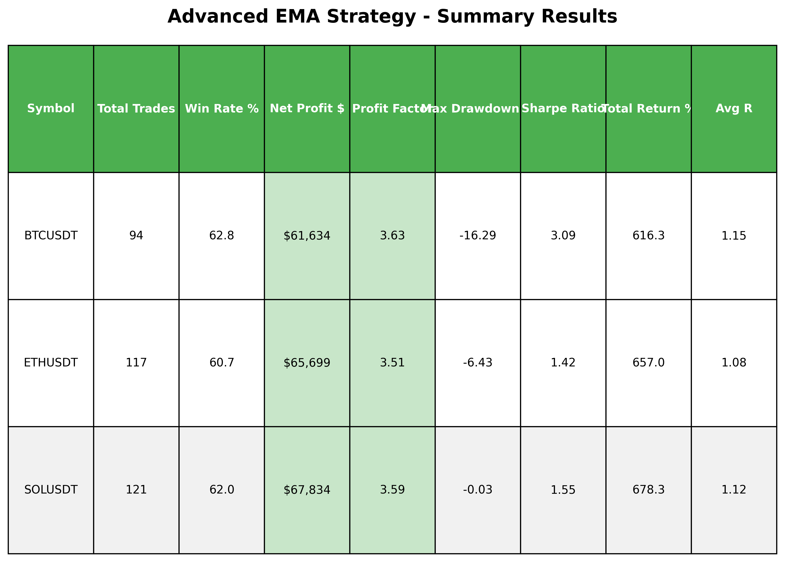

# 🚀 Advanced Trading Strategy Backtesting Engine

A modular Python-based backtesting engine designed to evaluate rule-based trading strategies across Forex and Cryptocurrency markets.

---

## 📊 Key Features

- ✅ Multi-asset support (BTCUSDT, ETHUSDT, SOLUSDT, EURUSD)
- ✅ EMA-based strategies with pullback confirmation
- ✅ Risk management (Stop-loss, Take-profit, Position sizing)
- ✅ Performance metrics:
  - Win Rate
  - Profit Factor
  - Sharpe Ratio
  - Max Drawdown
- ✅ Trade logging (CSV format)
- ✅ Visualization (equity curves, summary tables)

---

## 📈 Strategy Overview

This project implements an advanced EMA (9/20) pullback strategy with:
- Confirmation candle entries  
- Trend strength filtering  
- Dynamic trade management  

---

## 📉 Sample Results

| Symbol   | Win Rate | Profit Factor | Sharpe | Return |
|----------|----------|--------------|--------|--------|
| BTCUSDT  | 62.8%    | 3.63         | 3.09   | 616%   |
| ETHUSDT  | 60.7%    | 3.51         | 1.42   | 657%   |
| SOLUSDT  | 62.0%    | 3.59         | 1.55   | 678%   |

---

## 🖼️ Output Visualization

---

## 🛠 Tech Stack

- Python  
- Pandas  
- NumPy  
- Matplotlib  

---

## 📂 Project Structure
